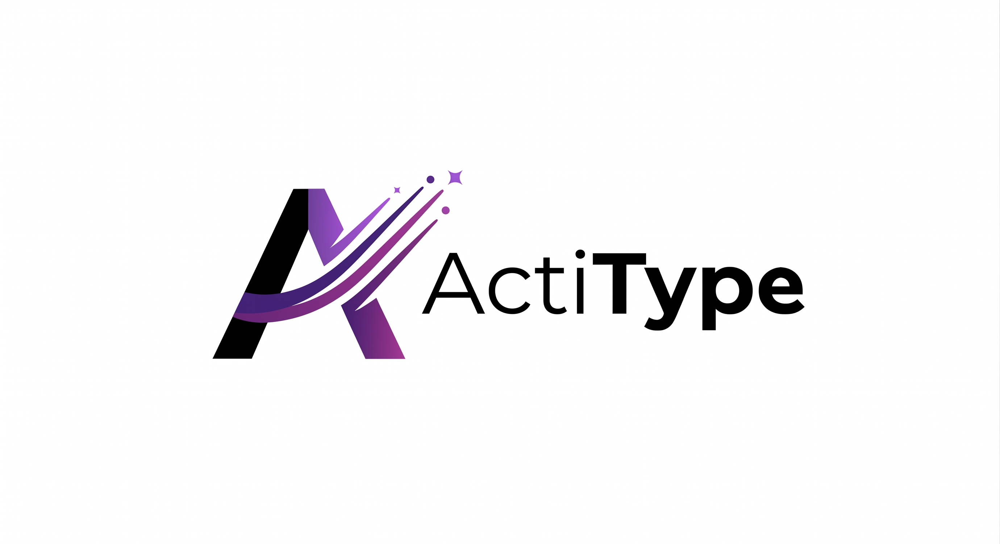
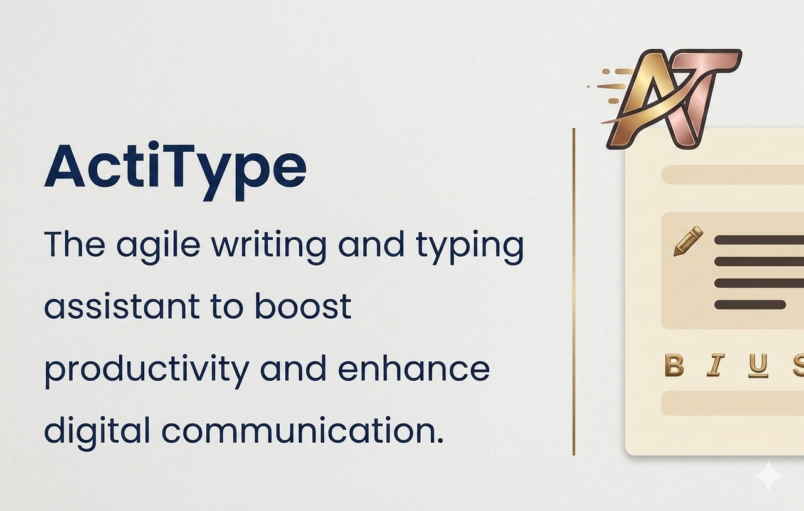

# ActiType - Smart Paste & Always Active Window Extension

## 🚀 Overview

ActiType is a powerful Chrome extension designed for restricted web environments. It provides:

- **Smart Paste** — Intelligent clipboard pasting with typing simulation to bypass paste detection
- **Always Active Window** — Keeps browser windows focused and active even when switching tabs or applications
- **Screen Share Stealth** — Intercepts and controls screen share requests with multiple modes
- **Webcam Stealth** — Spoofs or blocks webcam access with realistic dummy feeds
- **Timer Control** — Slow down or pause site countdown timers
- **Freedom Mode** — Re-enables right-click, text selection, copy, and DevTools on all sites

---

## ✨ Features

### 🎯 Smart Paste

- **Smart Typing**: Simulates natural typing to avoid detection with <kbd>Alt</kbd> + <kbd>D</kbd>
- **Paste Menu**: Specialized drag-and-drop paste with <kbd>Alt</kbd> + <kbd>Shift</kbd> + <kbd>V</kbd>
- **Force Copy**: Copy any selected text even on protected sites with <kbd>Alt</kbd> + <kbd>C</kbd>
- **HUD Toggle**: Cycle through notification visibility levels with <kbd>Alt</kbd> + <kbd>O</kbd>

### 👁️ Always Active Window

- **Focus Preservation**: Keeps browser window active even when switching applications
- **Visibility Spoofing**: `document.hidden` and `visibilityState` always report active
- **Mouse Boundary Lock**: Blocks `mouseleave`/`mouseout` detection on document edges
- **IntersectionObserver Spoof**: All elements report as visible and intersecting
- **Per-Site Control**: Enable/disable the feature on specific websites
- **Real-time Status**: Visual indicators showing current activation status
- **Background Operation**: Works seamlessly without interrupting your workflow

### 🖥️ Screen Share Stealth

- **Manual Mode**: Intercepts `getDisplayMedia` — lets you choose what to share
- **Auto-Block Mode**: Silently rejects all screen share requests
- **Auto-Blank Mode**: Shares a black screen automatically
- **Native Code Spoofing**: All proxied functions return `[native code]` to integrity checks

### 🎥 Webcam Stealth

- **Auto-Block**: Silently rejects all webcam access with proper error codes
- **Dark Room Mode**: Feeds a realistic dim-room video with head silhouette and camera noise
- **Freeze Frame Mode**: Captures one real frame, stops camera, loops it with subtle noise
- **Device Spoofing**: Track labels and capabilities match real hardware signatures

### ⏱️ Timer Control

- **3× Slowdown**: All `setInterval`/`setTimeout` timers run at one-third speed
- **Pause Mode**: New timers are stored but never fire — effectively frozen
- **Transparent**: Timer IDs work normally with `clearInterval`/`clearTimeout`

### 📡 Tab Isolation

- **BroadcastChannel Shield**: Tab-count heartbeat messages silently dropped
- **SharedWorker Isolation**: Tab registration spoofed to report single instance
- **localStorage Guard**: Cross-tab `storage` events suppressed for detection keywords

### 📋 Clipboard Shield

- **Read Protection**: `navigator.clipboard.readText()` returns empty to site scripts
- **Rich Content Block**: `navigator.clipboard.read()` returns empty array
- **Paste Handler Block**: Site `paste` event handlers neutralized (your paste still works)

### 🔓 Freedom Mode

- **Right-Click Re-enabled**: Context menu works everywhere
- **Text Selection Forced**: CSS `user-select: none` overridden globally
- **Copy/Cut Protected**: Keyboard shortcuts always work
- **DevTools Unlocked**: F12 shortcut bypasses site blocking
- **Navigation Lock Bypass**: `beforeunload` traps neutralized
- **Drag Protection Bypass**: `dragstart` prevention removed

### 🛡️ DevTools Shield

- **Window Size Spoofing**: `outerWidth` matches `innerWidth` to prevent dimension detection
- **Debugger Trap Removal**: `debugger` statements stripped from `Function()` and `eval()`
- **Console Timing Protection**: Timing-based DevTools detection neutralized
- **Inspection Getter Traps**: Element ID getter-based detection blocked

---

## 🔧 Installation

### Manual Installation (Developer Mode)

1. Download (zip) or clone this repository
2. Extract the folder
3. Open Chrome and navigate to `chrome://extensions/`
4. Enable **Developer mode** in the top right
5. Click **Load unpacked** and select the extension folder
6. The extension will appear in your toolbar

---

## 🎮 Usage

### Smart Paste

- **Method 1 — Keyboard Shortcut:**
  - Copy text to clipboard
  - Click in any text field
  - Press <kbd>Alt</kbd> + <kbd>Shift</kbd> + <kbd>V</kbd> to paste with typing simulation

- **Method 2 — Context Menu:**
  - Copy text to clipboard
  - Right-click on any text field
  - Select **"Drag and Drop Paste"** from the context menu

- **Method 3 — Force Copy:**
  - Select text on any protected page
  - Press <kbd>Alt</kbd> + <kbd>C</kbd> to force copy to clipboard

### Always Active Window

1. Click the extension icon in the toolbar
2. The **Always Active** toggle controls focus/visibility spoofing
3. The window will remain focused even when switching tabs or applications
4. Individual features (visibility, focus, blur, mouse) can be toggled independently

### Screen Share & Webcam

1. Click the extension icon in the toolbar
2. Use the **Screen Share Stealth** button to cycle through modes: Off → Manual → Block → Blank
3. Use the **Webcam Stealth** button to cycle through modes: Off → Block → Dark Room → Freeze
4. Current mode is shown with color-coded indicators

### Timer Control

1. Click the extension icon in the toolbar
2. Use the **Timer Control** button to cycle: Off → 3× Slow → Pause
3. Affects all new `setInterval`/`setTimeout` calls on the page

### Notification Visibility

- Press <kbd>Alt</kbd> + <kbd>O</kbd> to cycle toast notification opacity: High → Medium → Off

---

## ⚙️ Configuration

### Extension Popup

The extension popup provides easy access to:

- **Always Active Toggle**: Master switch for focus/visibility spoofing
- **Screen Share Mode**: Cycle through screen share stealth modes
- **Webcam Mode**: Cycle through webcam stealth modes
- **Timer Control**: Cycle through timer manipulation modes
- **Tab Isolation**: Status indicator for cross-tab detection blocking
- **Clipboard Shield**: Status indicator for clipboard read protection
- **Status Indicators**: Real-time color-coded feedback on all settings

---

## ⌨️ Keyboard Shortcuts

| Action | Windows / Linux | macOS |
|---|---|---|
| **Smart Paste** | <kbd>Alt</kbd> + <kbd>Shift</kbd> + <kbd>V</kbd> | <kbd>Option</kbd> + <kbd>Shift</kbd> + <kbd>V</kbd> |
| **Force Copy** | <kbd>Alt</kbd> + <kbd>C</kbd> | <kbd>Option</kbd> + <kbd>C</kbd> |
| **Toggle Notification Opacity** | <kbd>Alt</kbd> + <kbd>O</kbd> | <kbd>Option</kbd> + <kbd>O</kbd> |

---

## 🛡️ Security & Privacy

- **Local Storage Only**: All settings are stored locally on your device
- **No Data Collection**: The extension doesn't collect or transmit any personal data
- **Minimal Permissions**: Only requests necessary permissions for functionality
- **Open Source**: Code is available for review and audit
- **Native Code Spoofing**: 25+ proxied functions return `[native code]` to integrity checks
- **Shadow DOM Isolation**: All injected UI is encapsulated in closed shadow roots
- **DOM Query Protection**: Internal elements are hidden from site-level DOM queries

---

## 🚨 Limitations

- **Internal Chrome Pages**: Cannot operate on `chrome://` or `about:` pages due to browser security restrictions
- **Some Protected Sites**: May not work on sites with strict content security policies
- **Clipboard Access**: Requires user interaction to access clipboard content
- **Timer Pause Mode**: May disrupt interactive site elements — use Slow mode for general use

---

## 🐛 Troubleshooting

### Smart Paste Not Working

- Ensure the extension is enabled in `chrome://extensions/`
- Check that you're not on a restricted page (`chrome://`, `about:`, etc.)
- Try refreshing the page and attempting again

### Always Active Not Working

- Check that the feature is enabled in the extension popup
- Ensure the site is not in the restricted pages list
- Try disabling and re-enabling the feature

### Screen Share / Webcam Not Working

- Make sure you've selected a mode other than **Off**
- Refresh the page after changing modes — stealth scripts inject at page load
- Check the popup for the current mode indicator

### General Issues

- Refresh the webpage
- Reload the extension in `chrome://extensions/`
- Restart the browser
- Check browser console for error messages

---

## 🔄 Version History

### v3.0 Ghost
- Screen Share Stealth with 4 modes (Off/Manual/Block/Blank)
- Webcam Stealth with 4 modes (Off/Block/Dark Room/Freeze)
- Timer Freeze/Slowdown engine
- Tab Count Spoofing (BroadcastChannel, SharedWorker, localStorage)
- Clipboard Shield
- Navigation Lock Bypass
- DevTools detection bypass (5 vectors)
- 25+ functions spoofed with native code toString
- Cyberpunk dashboard UI

### v2.0
- Always Active Window with per-feature toggles
- Freedom Mode (right-click, text selection, copy unlock)
- Toast notification system with opacity control

### v1.0
- Initial release with basic functionality
- Smart paste with typing simulation
- Basic always-active window feature

---

## 🤝 Contributing

Contributions are welcome! Here's how you can help:

- **Bug Reports**: Open an issue with detailed reproduction steps
- **Feature Requests**: Suggest new features or improvements
- **Code Contributions**:
  1. Fork the repository
  2. Create a feature branch
  3. Make your changes
  4. Submit a pull request

---

## 📄 License

This project is licensed under the MIT License — see the [LICENSE](LICENSE) file for details.

---

  Built for students, by developers. Use responsibly.

